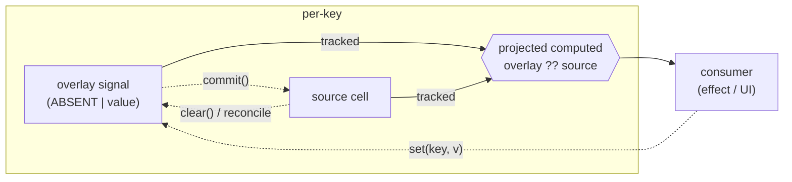

# @zakkster/lite-project

[](https://www.npmjs.com/package/@zakkster/lite-project)

[](https://github.com/sponsors/PeshoVurtoleta)
[](https://bundlephobia.com/result?p=@zakkster/lite-project)
[](https://www.npmjs.com/package/@zakkster/lite-project)
[](https://www.npmjs.com/package/@zakkster/lite-project)
[](https://github.com/PeshoVurtoleta/lite-signal)


[](https://opensource.org/licenses/MIT)

**Zero-GC projections for [@zakkster/lite-signal](https://www.npmjs.com/package/@zakkster/lite-signal).**

A *projection* is a granular, derived, **non-mutating** reactive view over a keyed source — a lens that carries ephemeral overlays (optimistic edits, drafts, "pending" state) without touching the underlying data, then `commit()`s those overlays into the source or `revert()`s them. It is the "Beyond Signals" projection primitive, built on lite-signal's node pool so the steady state allocates nothing the engine can avoid.



Each touched key owns **one overlay signal + one projected computed**. Reading a key tracks its effective value (overlay if staged, else source); overlaying key `A` never re-runs a consumer of key `B`.

---

## Install

```sh
npm i @zakkster/lite-project
```

Peer dependency: `@zakkster/lite-signal` `^1.5.0` (the projection relies on `createRoot`, which landed in 1.5.0).

## Quick start

```js
import { project, keyedStore } from "@zakkster/lite-project";
import { effect } from "@zakkster/lite-signal";

const store = keyedStore({ title: "untitled" });   // any reactive get/set source
const draft = project(store);

effect(() => console.log("showing:", draft.get("title")));   // "untitled"

draft.set("title", "Draft name");   // optimistic: prints "Draft name"
store.get("title");                 // still "untitled" -- source untouched

draft.commit();                     // writes the overlay into the store
draft.isOverlaid("title");          // false
```

## The three properties

- **granular** — reading key `K` subscribes only to `K`'s effective value (each projected key is its own computed). Overlaying one key never re-runs another key's consumer.
- **derived** — `get(key)` is reactive: it tracks **both** the overlay and the source cell, so a `revert()` (or a source change after a revert) flows through.
- **non-mutating** — `set(key, v)` writes an overlay **only**; the source is untouched until `commit()`. While a key is overlaid, a source change to it is *masked* (the projected value stays the overlay) and, thanks to the engine's `Object.is` short-circuit, does **not** churn downstream consumers. The optimistic value is stable under source noise — no flicker.

## Reactive dirty state

`dirtyCount()` and `isDirty()` are **tracked** — read them in an effect/computed to drive an "unsaved changes" badge or a Save button with no polling. (`isOverlaid` / `overlaidCount` stay untracked for diagnostic reads that must not subscribe.)

```js
effect(() => { saveButton.disabled = !draft.isDirty(); });   // re-runs only on clean<->dirty flips

draft.set("title", "x");   // -> isDirty() true, button enabled
draft.commit("title");     // commit just one field; -> back to clean
```

Updating the dirty count is allocation-free (a single fixed signal per projection, bumped on each presence transition), so the zero-GC property holds even with the Save effect subscribed.

## Zero-GC

In steady state the projection allocates nothing: toggling an overlay on a key you have already touched reuses its pooled nodes (verified — 200k overlay toggles on warmed keys leave `poolGrowths` and `totalAllocations` flat). The honest non-claim: the *first* touch of a **new** key allocates a slot record, a Map entry, and two pooled nodes (one overlay signal, one projected computed). Warm the keys you churn.

**Slots outlive `commit()` and `revert()`.** A slot is created by the first *read* of a key and retained until `dispose()`, because its projected computed may still have subscribers — clearing an overlay does not release it. Over a bounded keyspace (a form, a settings panel) that is exactly the point: the nodes are there to be reused. Over a large or unbounded one — a virtualised list, a record whose fields churn, a projection driven by user input — it is real growth that neither `commit()` nor `revert()` gives back.

`prune()` <sub>1.1</sub> is the reclamation path. It releases only slots that are **both** un-overlaid (no staged value to lose) and unobserved (no live consumer subscribed to the projected read), so it can never pull a computed out from under a subscriber; a pruned key rebuilds transparently on its next read. It is a cold path — call it on a viewport change or after a commit, never per frame — and it is `O(slots)`. It needs `hasObservers` from the registry to tell an unused slot from a watched one; a custom registry without it gets a `prune()` that safely reclaims nothing and returns `0`.

## API

### `createProjector(reg) -> { project, keyedStore }`

Bind the primitives to a lite-signal registry. Pass the default namespace for normal use, or a `createRegistry({...})` result for an isolated graph (tests, the zero-GC gate). The package also exports `project` and `keyedStore` pre-bound to the default registry for the common case.

### `project(source) -> Projection`

`source` is any object with a reactive `get(key)` and a `set(key, value)`. Returns a handle:

| method | description |
| --- | --- |
| `get(key)` | reactive: overlay value if staged, else the source value |
| `set(key, value)` | stage an **ephemeral** overlay (source untouched) |
| `clear(key)` | drop one key's overlay (revert that key) |
| `commit(key?)` | write one key's overlay (or, with no arg, all) into the source, then clear |
| `revert()` | drop all overlays |
| `dirtyCount()` | **tracked / reactive**: count of staged overlays — wire a Save badge to it |
| `isDirty()` | **tracked / reactive**: `dirtyCount() > 0` |
| `isOverlaid(key)` | untracked diagnostic: is the key overlaid? |
| `overlaidCount()` | untracked diagnostic: number of overlaid keys |
| `peek(key)` | untracked effective read (no subscribe) |
| `forEachOverlay(fn)` | iterate overlaid keys + values (untracked) |
| `reconcileAll(policy?)` | drop overlays the policy confirms against the current source |
| `prune()` | release slots for keys that are neither overlaid nor observed; returns how many were freed <sub>1.1</sub> |
| `dispose()` | recycle every projection-owned node back to the pool |

### `keyedStore(initial?) -> { get, set, has, keys }`

A minimal built-in keyed reactive source: one lazily-created signal per key. Handy when you do not need a full lite-store.

### Reconciliation helpers

- `confirmOnEcho(authoritative, overlay)` — default policy: confirmed once `Object.is(authoritative, overlay)` (the source echoed the optimistic value back).
- `makeReconciler(view, policy?)` — returns a per-key handler `(key, authoritativeValue) => void` for a source that emits incoming-update events. When an update arrives for an overlaid key and the policy confirms it, the overlay is dropped.

### Source adapters

- `fromAccessors(get, set)` — shape a plain accessor pair into a source.
- `fromProxy(obj)` — shape a property-style reactive store (a Proxy, a lite-store proxy) into a source; `obj[key]` must be a tracked read.

## Library adapters

### `projectStore(store)` — drafts over [lite-store](https://www.npmjs.com/package/@zakkster/lite-store)

```js
import { projectStore } from "@zakkster/lite-project";
import { store } from "@zakkster/lite-store";

const s = store({ name: "alice", age: 30 });
const draft = projectStore(s);

draft.set("name", "bob");   // draft only; s.name is still "alice"
draft.commit();             // s.name === "bob"
```

lite-store gives per-key signals, so the projection stays granular: overlaying or committing one key only re-runs that key's consumers. Projects the **top-level** keys of the given proxy — pass a nested proxy (`projectStore(s.user)`) to project deeper.

### `projectRoom(room, { policy })` — optimistic drafts over [lite-room](https://www.npmjs.com/package/@zakkster/lite-room)

```js
import { projectRoom } from "@zakkster/lite-project";

const draft = projectRoom(room);   // over room.storage (LWW-Map)

draft.set("cell:A1", "=SUM(B:B)"); // local optimistic edit, NOT synced
draft.commit();                    // promotes via room.storage.set (writes + syncs to peers)
```

Room storage is authoritative and CRDT-merged, so the projection is **presentation-only**: it never joins the merge. `set` stages a local draft, `commit()` promotes it through `room.storage.set`, and an auto-reconcile drops drafts once the authoritative value catches up (echo) while leaving a conflicting authoritative value **masked** (no flicker). Because `room.storage` is coarse (a single `entries` signal, a plain non-reactive `get`), the adapter subscribes through `entries()` and the projection inherits that coarse granularity. Call `dispose()` to stop the reconcile effect. Only `room.storage` is projectable this way; sets / lists / texts have non-keyed shapes.

### `projectQuery(qc, key, { data, policy, merge })` — optimistic field drafts over [lite-query](https://www.npmjs.com/package/@zakkster/lite-query)

```js
import { projectQuery } from "@zakkster/lite-project";

const query = qc.createQuery(["user", id], fetchUser);
const draft = projectQuery(qc, ["user", id], { data: query.data });

draft.set("name", "Ada");          // optimistic field edit, cache untouched
draft.set("email", "ada@x.dev");
draft.commit();                    // ONE setQueryData merging both fields back in
```

Projects a single query entry's data **object**, exposing its **fields** as the projected keys. `commit()` folds every staged field into the cached record in a **single** `setQueryData(key, prev => merge(prev, overlays))` write (one cache mutation, one broadcast), rather than one write per field; `commit(field)` writes just one. Pass the query's reactive `data` accessor so reads track the cache and an auto-reconcile drops drafts a refetch confirms (echo) while masking conflicts — omit it to degrade to a non-reactive `getQueryData` snapshot with no auto-reconcile. `merge` defaults to a shallow spread (a nullish `prev` seeds a fresh record); `policy` defaults to `confirmOnEcho`. The client is consumed structurally (`getQueryData` / `setQueryData`), so there's no hard dependency on lite-query. `dispose()` stops the reconcile effect.

The default merge copies **own enumerable** properties, symbols included, and defines them rather than assigning them. That matters for three field names you would otherwise lose silently: a field literally called `__proto__` lands as a real own key (assignment would retarget the prototype and drop it), inherited properties on `prev` are not absorbed into the record, and a symbol-keyed draft survives the commit instead of evaporating while `dirtyCount()` reports it saved. A custom `merge` is on its own for all three.

## Conventions

ESM only. ASCII source. `node:test`. MIT.

## License

MIT (c) 2026 Zahary Shinikchiev
